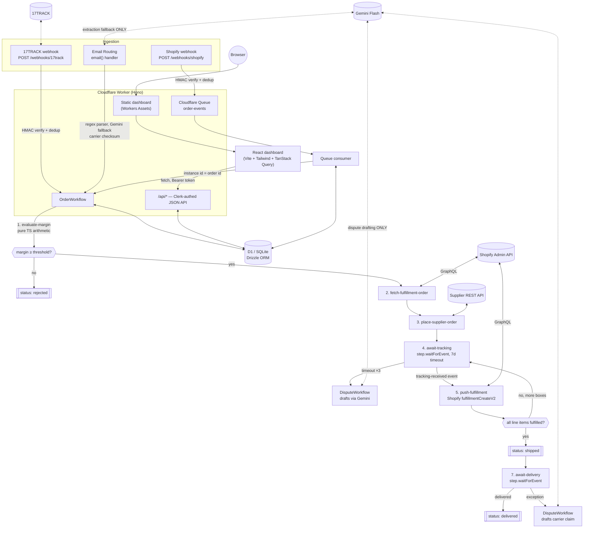

# Fulfillment Tracker

An event-driven B2B dropshipping fulfillment automation platform. It replaces web scrapers with
webhook + email ingestion: it receives storefront orders (Shopify), evaluates margin in plain code,
fulfills via supplier APIs, extracts tracking numbers from supplier emails (regex first, Gemini Flash
as a fallback only), validates them with carrier checksums, and pushes fulfillments back to Shopify
via the Fulfillment Orders API. Everything runs on the Cloudflare free tier — idle cost is $0.

## Architecture



**Hard architectural rules** (see `CLAUDE_CODE_BUILD_PROMPT.md` section 2 for the full list):
- No LLM anywhere in the margin/pricing/money path — `packages/core/src/margin.ts` is pure arithmetic.
- Gemini Flash is called in exactly two modules: email-extraction fallback and dispute-email drafting.
- Every tracking number is checksum/format-validated (`packages/core/src/carriers`) before it's
  written to a fulfillment or pushed to Shopify.
- Every inbound webhook is HMAC-verified and deduplicated before any processing.
- All slow work happens in Cloudflare Workflows — webhook handlers only persist + enqueue.

## Repository layout

```
packages/core/       pure logic — margin math, carrier checksums, email parsers. Zero Cloudflare imports.
packages/db/          Drizzle schema, migrations, deterministic seed data generator.
packages/adapters/     every external service behind an interface, with a real + a fixture-backed mock impl.
apps/worker/           Hono app: webhooks, email handler, queue consumer, Workflows, authed API.
apps/dashboard/        Vite + React + Tailwind dashboard, built into the Worker's static assets.
fixtures/               raw MIME email fixtures, Shopify webhook payloads, Gemini structured-output examples.
```

## Quickstart (local, zero credentials)

```
pnpm install
pnpm --filter @fulfillment-tracker/worker exec wrangler d1 migrations apply DB --local --config ../../wrangler.toml
pnpm --filter @fulfillment-tracker/worker exec wrangler d1 execute DB --local --file=../../packages/db/seed.sql --config ../../wrangler.toml
pnpm dev
```

Then open `http://localhost:8787` and click **Continue as dev user** — the dashboard, API, and seeded
D1 database are all running locally in `MOCK_MODE=true` (see `.dev.vars.example`). No Shopify,
Gemini, 17TRACK, or Clerk account is required to explore the full demo dataset (six orders across
every status, two suppliers, an open dispute, and a needs-review fulfillment).

Cloudflare Workflows themselves require live Cloudflare connectivity even in local dev (see
DEPLOY.md's "Known limitation" section) — everything else, including the full ingestion pipeline and
API, runs completely offline.

## Testing

```
pnpm ci   # lint && typecheck && test && build
```

- `packages/core`: margin math edge cases, every carrier validator (valid / single-digit-flip-invalid
  / wrong-length / ambiguous), both supplier email parsers.
- `packages/adapters`: every mock implementation, the shared HMAC helper, mock/real adapter selection.
- `apps/worker` (`@cloudflare/vitest-pool-workers`, running against a real D1 instance per test file):
  Shopify webhook HMAC accept/reject/duplicate-delivery idempotency, 17TRACK webhook, the email
  ingestion pipeline end-to-end (regex success, Gemini fallback success, needs-review failure,
  duplicate Message-ID), Workflow step logic (margin-reject path, split-shipment loop), and the API
  auth guard.
- `apps/dashboard`: Orders table renders seed data; the Fulfillments "Needs review" resolve flow calls
  `PATCH /api/fulfillments/:id`.

## Deploying for real

See [DEPLOY.md](./DEPLOY.md) — every step that needs a human (creating accounts, registering
webhooks, setting secrets) is listed with exact commands and console URLs.

## Design decisions

Every non-obvious choice made during the autonomous build — and why — is recorded in
[DECISIONS.md](./DECISIONS.md), in the order it was made.
